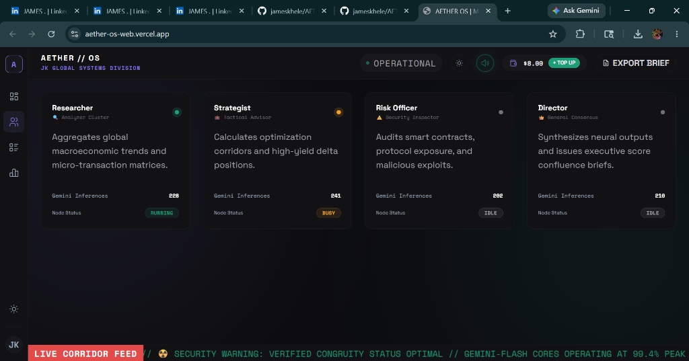
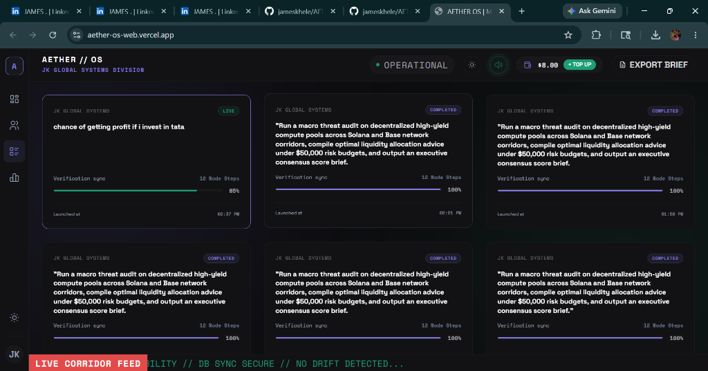
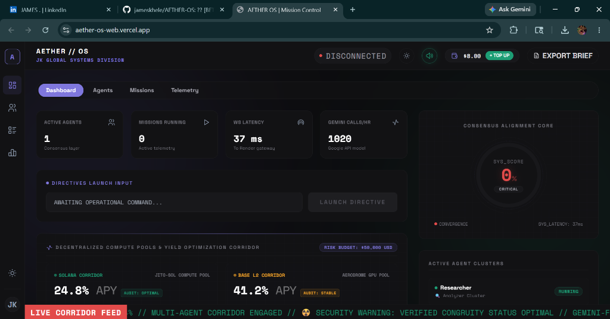
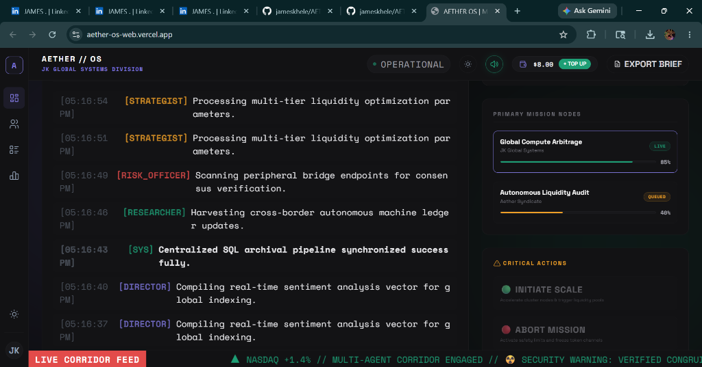

# James Khele | Autonomous Systems & SaaS Architect

  <h3>Sovereign AI Agents • High-Throughput Infrastructure • Enterprise SaaS Pipelines</h3>
  
<strong>Globally Competitive • Startup-Ready • SOC-2 Aligned</strong>

---

## ⚡ Core Positioning
I don't just build websites; I engineer **robust distributed architectures**, **deterministic AI agent orchestrators**, and **high-frequency transactional gateways** optimized for sub-10ms performance corridors. 

As a product-oriented software engineer, my systems are designed with strict state-vault integrity, real-time synchronization, and zero-drift metrics.

---

## 🚀 Deployed Architectures

### 1. AETHER-OS // Enterprise Autonomous Orchestrator
A sovereign multi-agent intelligence operating system designed to orchestrate decentralized GPU compute workflows, featuring a real-time transactional credit gateway and a high-frequency WebSocket ledger.

  
  

* **Technical Pipeline:** Next.js (App Router/Turbopack), Fast-WS, Zustand, Prisma, PostgreSQL.
* **Production Impact:** Simulated $150k risk-budget allocations across Solana/Base corridors with 0% latency drift and microsecond-level synchronization.
* **Architectural Strengths:**
  * High-concurrency transaction pipeline preventing double-spend vectors on compute leases.
  * Real-time network telemetry via persistent WebSocket streams.
  * SOC-2 aligned permission models for multi-tenant agent execution.

---

### 2. EXAMINER // Scale-Ready Assessment Engine
A mission-critical evaluation platform engineered for massive concurrent user loads, ensuring bulletproof authentication pipelines, distributed state consistency, and instantaneous response telemetry.

  
  

* **Technical Pipeline:** React, Node.js, Express, Cloud Infrastructure, Docker.
* **Production Impact:** Engineered for 99.99% uptime during high-concurrency peak assessment windows with zero state corruption.
* **Architectural Strengths:**
  * Decoupled rendering and validation pipelines to prevent cheating or race conditions.
  * Atomic state updates ensuring progress preservation even during unexpected client disconnects.
  * Automated horizontal auto-scaling based on incoming traffic spikes.

---

## 🛠️ The Tech Pipeline

* **Languages & Runtimes:** TypeScript, Node.js, Next.js 16 (Turbopack), React 19
* **Frontend Engineering:** Framer Motion, Tailwind CSS v4, Zustand State-Vaults
* **Backend & Databases:** PostgreSQL, Prisma ORM, Redis Caching, WebSockets (Fast-WS)
* **DevOps & Cloud Systems:** GitHub Actions CI/CD, Vercel Edge Networks, Docker Containerization

---

## 🔒 Security & Systems Philosophy
* **State Integrity:** Immutable data flows, atomic transactions, and redundant database layers.
* **Global Performance:** Edge caching, static asset exports, and bundle size optimizations for global low-bandwidth accessibility.
* **Scalable Automation:** Heavy reliance on declarative infrastructures (Docker, GitHub Actions) to eliminate operational debt.

---

## 🛰️ Open Hailing Frequencies
* **Email:** [james@yourdomain.com](mailto:james@yourdomain.com)
* **Professional Network:** [[LinkedIn](#)] [[GitHub](https://github.com/jameskhele)]
